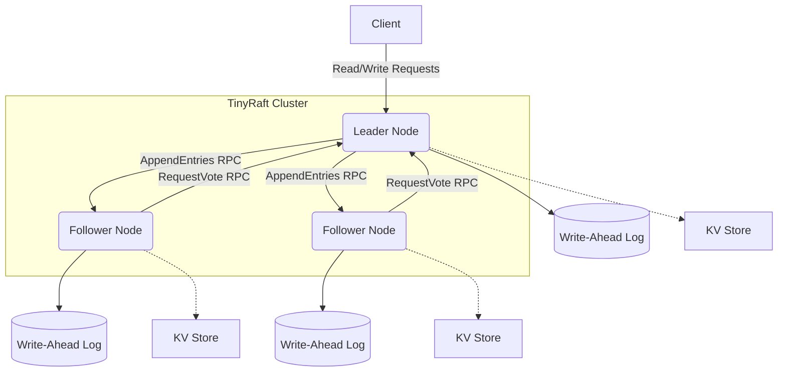
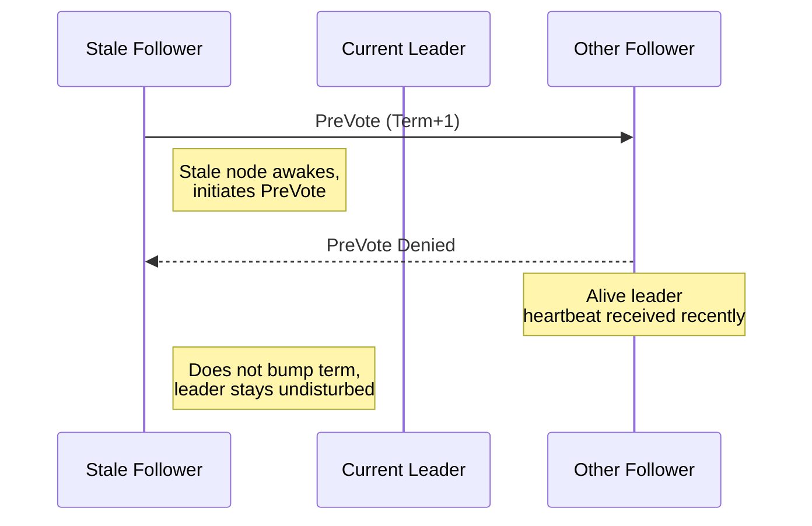

# Architecture

TinyRaft is designed to be minimal but entirely faithful to the Raft consensus algorithm.

## Raft Node Architecture

## Request Lifecycle

1. **Client Request**: Client sends a `set(key, value)` command to the leader.
2. **Log Append**: Leader appends the command to its local WAL.
3. **Replication**: Leader broadcasts `AppendEntries` to followers.
4. **Follower Append**: Followers validate the term and append to their WALs.
5. **Commit**: Once a majority of followers acknowledge, the leader marks the entry as committed.
6. **Apply**: Leader applies the committed command to the State Machine (KV Store).
7. **Response**: Leader responds to the client with the result.

## Failover Sequence (Pre-Vote)

