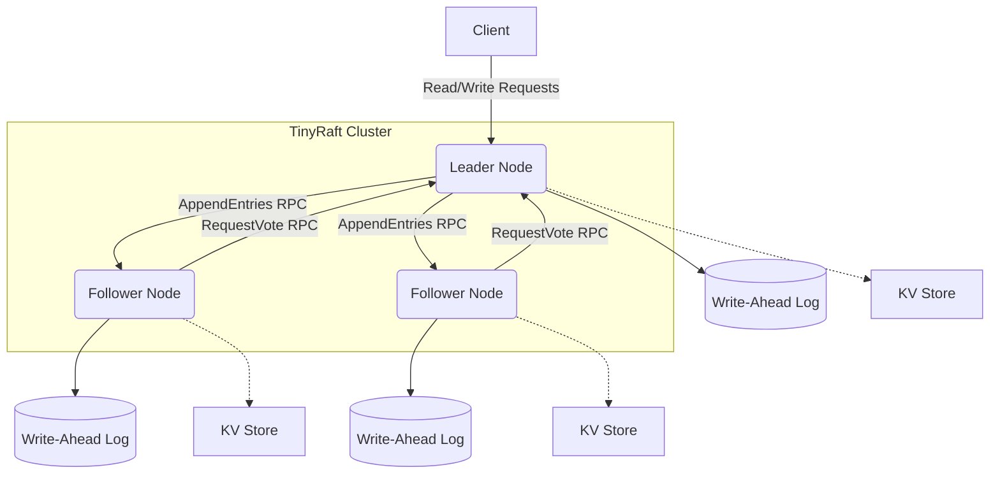

# 🚀 TinyRaft

> A from-scratch implementation of the **Raft consensus protocol** with a
> linearizable, replicated key/value store on top. Pure Python, zero
> dependencies, real TCP transport.

<p align="center">
  <a href="https://github.com/Luv-Goel/tinyraft/actions/workflows/ci.yml">
    
  </a>
  <a href="https://github.com/Luv-Goel/tinyraft/actions/workflows/pages.yml">
    
  </a>
  <a href="https://pypi.org/project/tinyraft/">
    
  </a>
  <a href="https://pypi.org/project/tinyraft/">
    
  </a>
  <a href="https://github.com/Luv-Goel/tinyraft/blob/main/LICENSE">
    
  </a>
</p>

📚 **[Read the Documentation](https://Luv-Goel.github.io/tinyraft/)** | 🐞 **[Report a Bug](https://github.com/Luv-Goel/tinyraft/issues/new)** | 🙋 **[Request a Feature](https://github.com/Luv-Goel/tinyraft/issues/new)**


Raft is the consensus algorithm behind etcd, Consul, TiKV and CockroachDB.
This repo implements it faithfully from the
[paper](https://raft.github.io/raft.pdf) — including the parts people often
skip — and proves it with integration tests that kill leaders mid-write and
restart crashed nodes against real sockets.

## What's implemented

| Feature | Where | Notes |
|---|---|---|
| Leader election, randomized timeouts | `tinyraft/node.py` | paper §5.2 |
| **Pre-vote** (§9.6) | `node.py:_prevote_round` | stale nodes can't disrupt a live leader |
| Log replication + `next_index` backtracking | `node.py:_replicate_to` | paper §5.3 |
| Commit only current-term entries by counting | `node.py:_advance_commit` | the §5.4.2 rule that prevents lost writes |
| Persistent state (term, vote, log) | `log.py`, `node.py` | JSON-lines WAL, fsync before ack |
| Conflict resolution / entry overwrite | `node.py:_on_append_entries` | paper §5.3 |
| Linearizable reads | `node.py:read` | §6.4 barrier via current-term commit |
| Replicated KV state machine | `tinyraft/kvstore.py` | get / set / delete / compare-and-swap |
| Crash-recovery & catch-up | `tinyraft/cluster.py` | restart with the same data dir |

Explicitly *not* included (documented future work): membership changes,
log compaction/snapshots, lease-based reads. The extension points are
already in place (`KVStore.snapshot`, `before`/`after_apply` hook).

## Quick start — watch Raft survive a leader crash

```bash
git clone https://github.com/Luv-Goel/tinyraft.git
cd tinyraft
python examples/demo.py        # no pip install needed, stdlib only
```

```
============  ELECTION  ============
node  state     term  leader  log   kv-size
n0    follower  1     n2      1     0
n1    follower  1     n2      1     0
n2    leader    1     n2      1     0
  -> leader elected: n2 (term 1)

============  FAILOVER: killing the leader (n2)  ============
node  state     term  leader  log   kv-size
n0    leader    3     n0      6     2
n1    follower  3     n0      6     2
  -> new leader: n0 (term 3)
  committed data survived:
  get 'lang'      = python
  get 'consensus' = raft+paxos?-no-just-raft
```

## Architecture



## Use it as a library

```python
import asyncio
from tinyraft import Cluster, Client

async def main():
    cluster = Cluster(3)          # 3 real TCP nodes on localhost
    await cluster.start()
    _, leader = await cluster.wait_for_leader()

    client = Client({n.id: n for n in cluster.live()})
    await client.set("color", "purple")          # committed on a majority
    assert await client.cas("color", "purple", "gold")
    print(await client.get("color"))             # -> 'gold'  (linearizable)

    await cluster.crash(leader.id)               # kill the leader mid-flight
    _, new_leader = await cluster.wait_for_leader()
    assert await new_leader.read("color") == "gold"   # nothing lost

    await cluster.stop()

asyncio.run(main())
```

## Wire protocol

Nodes speak length-prefixed JSON over TCP — you can watch a live cluster
with `nc`:

```
┌─ 4-byte frame length ─┐{ "type": "append_entries", "data": {
                          "term": 4, "leader_id": "n1",
                          "prev_log_index": 12, "prev_log_term": 3,
                          "entries": [ {"term": 4, "command": {...}} ],
                          "leader_commit": 11 } }
```

Messages: `request_vote`, `request_vote_reply`, `append_entries`,
`append_entries_reply` (`tinyraft/messages.py`). Pre-vote is a flagged
`request_vote`, so observation tooling stays trivial.

## Tests

18 tests covering the log, the state machine, elections, replication,
failover, persistence and client semantics — all against **real sockets**,
no mocking of the consensus path:

```bash
python -m unittest discover -s tests -v
```

Highlights:

- `test_committed_data_survives_leader_crash` — write → kill leader →
  re-elect → read must return the old value
- `test_restarted_node_catches_up` — crash a follower, write 5 entries,
  restart it, wait for full replication
- `test_no_new_commits_without_quorum` — an isolated leader must never
  commit new entries
- `test_state_persists_across_restart` — term, vote and the log survive
  process restarts (fsync'd WAL)

## HTTP Proxy Example

TinyRaft includes a built-in HTTP proxy that exposes the Raft KV store via a REST API:

```bash
# Install optional dependencies for examples
pip install -e .[examples]

# Run the proxy with a 3-node cluster
python examples/http_proxy.py --nodes 3 --port 8080
```

You can then test it using `curl`:

```bash
# Get cluster status
curl http://localhost:8080/status

# Set a key
curl -X POST -H "Content-Type: application/json" -d '{"value": "bar"}' http://localhost:8080/kv/foo

# Get the key
curl http://localhost:8080/kv/foo
```

## Design notes

- **Why pre-vote matters:** without it (vanilla Raft), a restarted lagging
  node fires elections with ever-higher terms; every round forces the
  healthy leader to step down even though the stale node can never win.
  With pre-vote the stale node probes first, gets refused, and the leader
  is never disturbed — visible in the trace as terms staying flat during
  catch-up.
- **§5.4.2 is load-bearing:** a leader may only mark an entry *committed
  by counting replicas* if the entry belongs to its own term. Ignoring
  this is the classic way Raft implementations lose acknowledged writes;
  `_advance_commit` enforces it and the failover tests exercise it.
- **Deterministic applier:** entries apply in log order on every node;
  `client_command` waits for its own entry to apply before returning the
  state machine's result, so writes are applied exactly once.

## Repo layout

```
tinyraft/
├── tinyraft/
│   ├── node.py       # RaftNode: elections, replication, commit, apply
│   ├── log.py        # persistent 1-indexed log (JSON-lines WAL)
│   ├── messages.py   # wire protocol (length-prefixed JSON)
│   ├── kvstore.py    # state machine: get/set/delete/CAS
│   ├── cluster.py    # in-process N-node harness for tests & demos
│   └── client.py     # leader-tracking client with retries
├── tests/            # 18 tests, unittest, zero dependencies
├── examples/demo.py  # the scripted run shown above
└── .github/workflows/ci.yml
```

## License

MIT — see [LICENSE](LICENSE).
